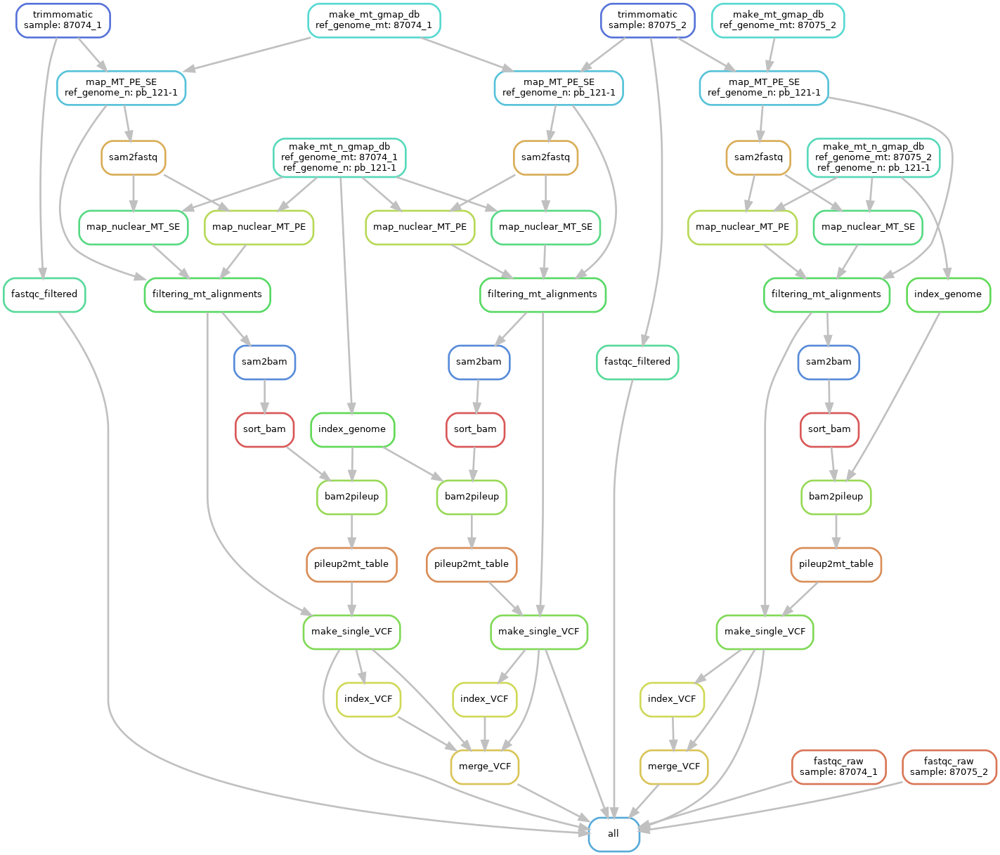

# MToolBox on non-human genomes

<!-- TOC START min:1 max:4 link:true update:true -->
- [MToolBox on non-human genomes: Heterobasidion](#mtoolbox-on-non-human-genomes-heterobasidion)
   - [Installation](#installation)
      - [Installation of Anaconda](#installation-of-anaconda)
      - [Installation of the MToolBox workflow](#installation-of-the-mtoolbox-workflow)
      - [Copy/symlink data](#copysymlink-data)
   - [Running the pipeline](#running-the-pipeline)
      - [Activation of the conda environment](#activation-of-the-conda-environment)
      - [Compile configuration files](#compile-configuration-files)
         - [`data/analysis.tab`](#dataanalysistab)
         - [`data/reference_genomes.tab`](#datareference_genomestab)
      - [Run the whole workflow](#run-the-whole-workflow)
      - [Outputs](#outputs)
         - [Notes on outputs](#notes-on-outputs)
   - [Notes](#notes)
      - [Deactivation of the environment](#deactivation-of-the-environment)
   - [Graphical representation of the workflow](#graphical-representation-of-the-workflow)
   - [Acknowledgements](#acknowledgements)

<!-- TOC END -->


## Installation

### Installation of Anaconda

The grid implementation of the MToolBox snakemake workflow, a side project of the MToolBox pipeline (https://github.com/mitoNGS/MToolBox), is deployed in a conda environment, _i.e._ a virtual environment with all the needed tools/modules. Installing Anaconda is therefore essential, before installing the pipeline.

To this purpose, please follow instructions at http://docs.anaconda.com/anaconda/install/linux/ (hint: download the Anaconda installer in your personal directory with  `wget https://repo.continuum.io/archive/Anaconda3-2018.12-Linux-x86_64.sh`).

**Note on installation**: step 11 (verify installation by opening `anaconda-navigator`) is not compulsory. However, if you wish to do so, please make sure you have logged in the grid with either the `-X` or the `-Y` option, *e.g.* `ssh -Y username@my-mgrid.mykopat.slu.se`.

### Installation of the MToolBox-Ark workflow

The workflow and the input/output data will be in the same folder, it is strongly recommended to install the workflow in some subfolder of `/nfs4/my-gridfront/mykopat-proj3/mykopat-hmtgen/`. In this example this folder will be `/nfs4/my-gridfront/mykopat-proj3/mykopat-hmtgen/heterobasidion_MToolBox`.

**Please note**: to `git clone` the repository you need to have an account on https://github.com/.

```bash
# create directory and go there
export pipelineDir="/nfs4/my-gridfront/mykopat-proj3/mykopat-hmtgen/heterobasidion_MToolBox"

mkdir -p $pipelineDir
cd $pipelineDir

# update git
conda install git

# fetch repo
git clone https://github.com/SLUBioinformaticsInfrastructure/MToolBox-Ark.git

# install environment
cd MToolBox-Ark
conda env create \
-n mtoolbox-ark \
-f envs/environment.yaml

# create folders needed by the workflow
mkdir -p data/reads
mkdir -p data/genomes
mkdir -p logs/cluster_jobs
```

## Running the pipeline

### Copy/symlink data

Copy or symlink read datasets in the `data/reads` folder.  
Copy or symlink genome fasta files in the `data/genomes` folder. **IMPORTANT**: please copy **one file** containing **only** the nuclear genome and **one file** containing **only** the mitochondrial genome.

### Activation of the conda environment

```bash
# To activate this environment, use
source activate mtoolbox-ark
```

### Preparation of configuration files

**Please read the "Notes on configuration files" at the end of this section.**

#### `data/analysis.tab`

Example:

|   sample   | ref_genome_mt |   ref_genome_n  |
|:----------:|:-------------:|:---------------:|
|  5517_hypo |  NC_001323.1  | GCF_000002315.5 |
| 5517_liver |  NC_001323.1  | GCF_000002315.5 |

The workflow will execute as many analyses as the number of non-commented (i.e. not starting with `#`) lines in this file. Hint: instead of removing lines, you can comment them by prepending a `#` so that they will be skipped.
Every analysis is configured by one row in this table. Specifically:

- **sample** is the sample for which the read datasets will be used;
- **ref_genome_mt** is the reference mitochondrial genome used in the analysis;
- **ref_genome_n** is the reference mitochondrial genome used in the analysis.

*Eg*: The first row specifies that variant calling (with heteroplasmy) will be performed on sample 5517_hypo using the mitochondrial reference genome NC_001323.1, by discarding those reads aligning on the nuclear reference genome GCF_000002315.5. Please note that the names used in this table will be used in the workflow execution (and are case-sensitive). Actual read dataset names will be detailed in the `data/datasets.tab` table.

#### `data/reference_genomes.tab`

Structure (strictly **tab-separated**):

| ref_genome_mt |      ref_genome_n     | ref_genome_mt_file |   ref_genome_n_file   |
|:-------------:|:---------------------:|:------------------:|:---------------------:|
|  NC_001323.1  | GCF_000002315.5.fasta |  NC_001323.1.fasta | GCF_000002315.5.fasta |

This table contains explicit names for reference genome files used in the workflow. Names in the columns `ref_genome_mt` and `ref_genome_n` should be consistent with the ones in the same columns in the `data/analysis.tab` table. Genome files must be located in the `data/genomes` folder.

#### `data/datasets.tab`

Fill this table with as many read (paired) datasets are available per sample. Each read dataset will be processed independently and merged with the others from the same sample before the variant calling stage.

Example:

|   sample   |                   R1                   |                   R2                   |
|:----------:|:--------------------------------------:|:--------------------------------------:|
|  5517_hypo |  5517_hypo_ATCACG_L003_R1_001.fastq.gz |  5517_hypo_ATCACG_L003_R2_001.fastq.gz |
|  5517_hypo |  5517_hypo_ATCACG_L004_R1_001.fastq.gz |  5517_hypo_ATCACG_L004_R2_001.fastq.gz |
| 5517_liver | 5517_liver_CAGATC_L001_R1_001.fastq.gz | 5517_liver_CAGATC_L001_R2_001.fastq.gz |
| 5517_liver | 5517_liver_CAGATC_L002_R1_001.fastq.gz | 5517_liver_CAGATC_L002_R2_001.fastq.gz |

#### Notes on configuration files

- All configuration files are **stricly tab-separated tables**;
- Table headings (*e.g.* "sample", "R1"...) are needed for the execution of the workflow and are **case-sensitive**;
- Lines can be skipped by prepending a `#` ("commenting", in jargon) them. This is particularly useful *e.g.* if you want to run the workflow on a subset of samples without deleting lines from the `data/analysis.tab` table. *E.g.*:

|   sample   | ref_genome_mt |   ref_genome_n  |
|:----------:|:-------------:|:---------------:|
|  5517_hypo |  NC_001323.1  | GCF_000002315.5 |
|#5517_liver |  NC_001323.1  | GCF_000002315.5 |

will run the workflow only on the sample 5517_hypo.

### Graphical representation of the workflow

Before running the workflow, it's good practice to check if the provided setup is correct. You can run `snakemake -nrp` to execute a dry run and get a list of the files that will be created and the commands that will be run.

A graphical - and probably more user-friendly - representation of the workflow can be obtained by running

```bash
snakemake --dag | dot -Tsvg > my_workflow.svg
```

The graph in file `my_workflow.svg` will report all the workflow steps (for each sample in the `analysis.tab` configuration file). Steps in dashed lines are to be run (because their outputs are not present), whereas outputs for steps in solid lines are already present. A graphical representation of the workflow as per the `analysis.tab` file in this repo is reported as follows.




### Run the whole workflow

#### qsub

The workflow is primary built to be run on a computing cluster with a job scheduling system. A possible command line involving the qsub scheduling system is:

```bash
nohup \
snakemake -rpk \
-j 100 --cluster-config cluster.yaml --latency-wait 60 \
--cluster 'qsub -V -l h_rt={cluster.time} -l h_vmem={cluster.vmem} -pe smp {cluster.threads} -cwd -j y -o {cluster.stdout}' &> logs/nohup_MToolBox-Ark.log &
```

#### SLURM

```bash
nohup \
snakemake -rpk -j 100 \
--cluster-config cluster.yaml --latency-wait 60 \
--cluster 'sbatch -A snic2018-8-310 -p core -n {cluster.threads} -t {cluster.time} -o {cluster.stdout}' &> logs/nohup_MToolBox-Ark.log &
```

The file `logs/nohup_MToolBox.log` contains info about the whole run. The `logs` folder will also contain logs for each step of the workflow.

### Outputs

Folders created during the workflow execution: `results`, `gmap_db`, `logs`.

- `results` folder tree

```
results
├── 5517_hypo
│   ├── 5517_hypo_NC_001323.1_GCF_000002315.5.bed
│   ├── 5517_hypo_NC_001323.1_GCF_000002315.5.vcf.gz
│   ├── 5517_hypo_NC_001323.1_GCF_000002315.5.vcf.gz.csi
│   ├── map
│   │   ├── 5517_hypo_NC_001323.1_GCF_000002315.5_OUT-sorted.bam
│   │   ├── OUT_5517_hypo_ATCACG_L003_NC_001323.1_GCF_000002315.5
│   │   │   ├── 5517_hypo_ATCACG_L003_NC_001323.1_GCF_000002315.5_OUT.bam
│   │   │   ├── 5517_hypo_ATCACG_L003_NC_001323.1_GCF_000002315.5_outP.sam.gz
│   │   │   ├── 5517_hypo_ATCACG_L003_NC_001323.1_GCF_000002315.5_OUT.sam.gz
│   │   │   ├── 5517_hypo_ATCACG_L003_NC_001323.1_GCF_000002315.5_OUT-sorted.bam
│   │   │   ├── 5517_hypo_ATCACG_L003_NC_001323.1_GCF_000002315.5_outS.sam.gz
│   │   │   ├── 5517_hypo_ATCACG_L003_NC_001323.1_outmt1.fastq.gz
│   │   │   ├── 5517_hypo_ATCACG_L003_NC_001323.1_outmt2.fastq.gz
│   │   │   ├── 5517_hypo_ATCACG_L003_NC_001323.1_outmt.fastq.gz
│   │   │   └── 5517_hypo_ATCACG_L003_NC_001323.1_outmt.sam.gz
│   │   ├── OUT_5517_hypo_ATCACG_L004_NC_001323.1_GCF_000002315.5
│   │   │   ├── 5517_hypo_ATCACG_L004_NC_001323.1_GCF_000002315.5_OUT.bam
│   │   │   ├── 5517_hypo_ATCACG_L004_NC_001323.1_GCF_000002315.5_outP.sam.gz
│   │   │   ├── 5517_hypo_ATCACG_L004_NC_001323.1_GCF_000002315.5_OUT.sam.gz
│   │   │   ├── 5517_hypo_ATCACG_L004_NC_001323.1_GCF_000002315.5_OUT-sorted.bam
│   │   │   ├── 5517_hypo_ATCACG_L004_NC_001323.1_GCF_000002315.5_outS.sam.gz
│   │   │   ├── 5517_hypo_ATCACG_L004_NC_001323.1_outmt1.fastq.gz
│   │   │   ├── 5517_hypo_ATCACG_L004_NC_001323.1_outmt2.fastq.gz
│   │   │   ├── 5517_hypo_ATCACG_L004_NC_001323.1_outmt.fastq.gz
│   │   │   └── 5517_hypo_ATCACG_L004_NC_001323.1_outmt.sam.gz
│   │   ├── OUT_5517_hypo_ATCACG_L005_NC_001323.1_GCF_000002315.5
│   │   │   ├── 5517_hypo_ATCACG_L005_NC_001323.1_GCF_000002315.5_OUT.bam
│   │   │   ├── 5517_hypo_ATCACG_L005_NC_001323.1_GCF_000002315.5_outP.sam.gz
│   │   │   ├── 5517_hypo_ATCACG_L005_NC_001323.1_GCF_000002315.5_OUT.sam.gz
│   │   │   ├── 5517_hypo_ATCACG_L005_NC_001323.1_GCF_000002315.5_OUT-sorted.bam
│   │   │   ├── 5517_hypo_ATCACG_L005_NC_001323.1_GCF_000002315.5_outS.sam.gz
│   │   │   ├── 5517_hypo_ATCACG_L005_NC_001323.1_outmt1.fastq.gz
│   │   │   ├── 5517_hypo_ATCACG_L005_NC_001323.1_outmt2.fastq.gz
│   │   │   ├── 5517_hypo_ATCACG_L005_NC_001323.1_outmt.fastq.gz
│   │   │   └── 5517_hypo_ATCACG_L005_NC_001323.1_outmt.sam.gz
│   │   └── OUT_5517_hypo_ATCACG_L008_NC_001323.1_GCF_000002315.5
│   │       ├── 5517_hypo_ATCACG_L008_NC_001323.1_GCF_000002315.5_OUT.bam
│   │       ├── 5517_hypo_ATCACG_L008_NC_001323.1_GCF_000002315.5_outP.sam.gz
│   │       ├── 5517_hypo_ATCACG_L008_NC_001323.1_GCF_000002315.5_OUT.sam.gz
│   │       ├── 5517_hypo_ATCACG_L008_NC_001323.1_GCF_000002315.5_OUT-sorted.bam
│   │       ├── 5517_hypo_ATCACG_L008_NC_001323.1_GCF_000002315.5_outS.sam.gz
│   │       ├── 5517_hypo_ATCACG_L008_NC_001323.1_outmt1.fastq.gz
│   │       ├── 5517_hypo_ATCACG_L008_NC_001323.1_outmt2.fastq.gz
│   │       ├── 5517_hypo_ATCACG_L008_NC_001323.1_outmt.fastq.gz
│   │       └── 5517_hypo_ATCACG_L008_NC_001323.1_outmt.sam.gz
│   └── variant_calling
│       ├── 5517_hypo_NC_001323.1_GCF_000002315.5_OUT-mt_table.txt
│       └── 5517_hypo_NC_001323.1_GCF_000002315.5_OUT-sorted.pileup
├── 5517_liver
│   ├── 5517_liver_NC_001323.1_GCF_000002315.5.bed
│   ├── 5517_liver_NC_001323.1_GCF_000002315.5.vcf.gz
│   ├── 5517_liver_NC_001323.1_GCF_000002315.5.vcf.gz.csi
│   ├── map
│   │   ├── 5517_liver_NC_001323.1_GCF_000002315.5_OUT-sorted.bam
│   │   ├── 5517_liver_NC_001323.1_GCF_000002315.5_OUT-sorted.bam.bai
│   │   ├── OUT_5517_liver_CAGATC_L001_NC_001323.1_GCF_000002315.5
│   │   │   ├── 5517_liver_CAGATC_L001_NC_001323.1_GCF_000002315.5_OUT.bam
│   │   │   ├── 5517_liver_CAGATC_L001_NC_001323.1_GCF_000002315.5_outP.sam.gz
│   │   │   ├── 5517_liver_CAGATC_L001_NC_001323.1_GCF_000002315.5_OUT.sam.gz
│   │   │   ├── 5517_liver_CAGATC_L001_NC_001323.1_GCF_000002315.5_OUT-sorted.bam
│   │   │   ├── 5517_liver_CAGATC_L001_NC_001323.1_GCF_000002315.5_outS.sam.gz
│   │   │   ├── 5517_liver_CAGATC_L001_NC_001323.1_outmt1.fastq.gz
│   │   │   ├── 5517_liver_CAGATC_L001_NC_001323.1_outmt2.fastq.gz
│   │   │   ├── 5517_liver_CAGATC_L001_NC_001323.1_outmt.fastq.gz
│   │   │   └── 5517_liver_CAGATC_L001_NC_001323.1_outmt.sam.gz
│   │   ├── OUT_5517_liver_CAGATC_L002_NC_001323.1_GCF_000002315.5
│   │   │   ├── 5517_liver_CAGATC_L002_NC_001323.1_GCF_000002315.5_OUT.bam
│   │   │   ├── 5517_liver_CAGATC_L002_NC_001323.1_GCF_000002315.5_outP.sam.gz
│   │   │   ├── 5517_liver_CAGATC_L002_NC_001323.1_GCF_000002315.5_OUT.sam.gz
│   │   │   ├── 5517_liver_CAGATC_L002_NC_001323.1_GCF_000002315.5_OUT-sorted.bam
│   │   │   ├── 5517_liver_CAGATC_L002_NC_001323.1_GCF_000002315.5_outS.sam.gz
│   │   │   ├── 5517_liver_CAGATC_L002_NC_001323.1_outmt1.fastq.gz
│   │   │   ├── 5517_liver_CAGATC_L002_NC_001323.1_outmt2.fastq.gz
│   │   │   ├── 5517_liver_CAGATC_L002_NC_001323.1_outmt.fastq.gz
│   │   │   └── 5517_liver_CAGATC_L002_NC_001323.1_outmt.sam.gz
│   │   ├── OUT_5517_liver_CAGATC_L004_NC_001323.1_GCF_000002315.5
│   │   │   ├── 5517_liver_CAGATC_L004_NC_001323.1_GCF_000002315.5_OUT.bam
│   │   │   ├── 5517_liver_CAGATC_L004_NC_001323.1_GCF_000002315.5_outP.sam.gz
│   │   │   ├── 5517_liver_CAGATC_L004_NC_001323.1_GCF_000002315.5_OUT.sam.gz
│   │   │   ├── 5517_liver_CAGATC_L004_NC_001323.1_GCF_000002315.5_OUT-sorted.bam
│   │   │   ├── 5517_liver_CAGATC_L004_NC_001323.1_GCF_000002315.5_outS.sam.gz
│   │   │   ├── 5517_liver_CAGATC_L004_NC_001323.1_outmt1.fastq.gz
│   │   │   ├── 5517_liver_CAGATC_L004_NC_001323.1_outmt2.fastq.gz
│   │   │   ├── 5517_liver_CAGATC_L004_NC_001323.1_outmt.fastq.gz
│   │   │   └── 5517_liver_CAGATC_L004_NC_001323.1_outmt.sam.gz
│   │   └── OUT_5517_liver_CAGATC_L007_NC_001323.1_GCF_000002315.5
│   │       ├── 5517_liver_CAGATC_L007_NC_001323.1_GCF_000002315.5_OUT.bam
│   │       ├── 5517_liver_CAGATC_L007_NC_001323.1_GCF_000002315.5_outP.sam.gz
│   │       ├── 5517_liver_CAGATC_L007_NC_001323.1_GCF_000002315.5_OUT.sam.gz
│   │       ├── 5517_liver_CAGATC_L007_NC_001323.1_GCF_000002315.5_OUT-sorted.bam
│   │       ├── 5517_liver_CAGATC_L007_NC_001323.1_GCF_000002315.5_outS.sam.gz
│   │       ├── 5517_liver_CAGATC_L007_NC_001323.1_outmt1.fastq.gz
│   │       ├── 5517_liver_CAGATC_L007_NC_001323.1_outmt2.fastq.gz
│   │       ├── 5517_liver_CAGATC_L007_NC_001323.1_outmt.fastq.gz
│   │       └── 5517_liver_CAGATC_L007_NC_001323.1_outmt.sam.gz
│   └── variant_calling
│       ├── 5517_liver_NC_001323.1_GCF_000002315.5_OUT-mt_table.txt
│       └── 5517_liver_NC_001323.1_GCF_000002315.5_OUT-sorted.pileup
├── fastqc_raw
│   ├── 5517_hypo_ATCACG_L003_R1_001_fastqc.html
│   ├── 5517_hypo_ATCACG_L003_R1_001_fastqc.zip
│   ├── 5517_hypo_ATCACG_L003_R2_001_fastqc.html
│   ├── 5517_hypo_ATCACG_L003_R2_001_fastqc.zip
│   ├── 5517_hypo_ATCACG_L004_R1_001_fastqc.html
│   ├── 5517_hypo_ATCACG_L004_R1_001_fastqc.zip
│   ├── 5517_hypo_ATCACG_L004_R2_001_fastqc.html
│   ├── 5517_hypo_ATCACG_L004_R2_001_fastqc.zip
│   ├── 5517_hypo_ATCACG_L005_R1_001_fastqc.html
│   ├── 5517_hypo_ATCACG_L005_R1_001_fastqc.zip
│   ├── 5517_hypo_ATCACG_L005_R2_001_fastqc.html
│   ├── 5517_hypo_ATCACG_L005_R2_001_fastqc.zip
│   ├── 5517_hypo_ATCACG_L008_R1_001_fastqc.html
│   ├── 5517_hypo_ATCACG_L008_R1_001_fastqc.zip
│   ├── 5517_hypo_ATCACG_L008_R2_001_fastqc.html
│   ├── 5517_hypo_ATCACG_L008_R2_001_fastqc.zip
│   ├── 5517_liver_CAGATC_L001_R1_001_fastqc.html
│   ├── 5517_liver_CAGATC_L001_R1_001_fastqc.zip
│   ├── 5517_liver_CAGATC_L001_R2_001_fastqc.html
│   ├── 5517_liver_CAGATC_L001_R2_001_fastqc.zip
│   ├── 5517_liver_CAGATC_L002_R1_001_fastqc.html
│   ├── 5517_liver_CAGATC_L002_R1_001_fastqc.zip
│   ├── 5517_liver_CAGATC_L002_R2_001_fastqc.html
│   ├── 5517_liver_CAGATC_L002_R2_001_fastqc.zip
│   ├── 5517_liver_CAGATC_L004_R1_001_fastqc.html
│   ├── 5517_liver_CAGATC_L004_R1_001_fastqc.zip
│   ├── 5517_liver_CAGATC_L004_R2_001_fastqc.html
│   ├── 5517_liver_CAGATC_L004_R2_001_fastqc.zip
│   ├── 5517_liver_CAGATC_L007_R1_001_fastqc.html
│   ├── 5517_liver_CAGATC_L007_R1_001_fastqc.zip
│   ├── 5517_liver_CAGATC_L007_R2_001_fastqc.html
│   └── 5517_liver_CAGATC_L007_R2_001_fastqc.zip
├── fastqc_filtered
│   ├── 5517_hypo_ATCACG_L003_qc_R1_fastqc.html
│   ├── 5517_hypo_ATCACG_L003_qc_R1_fastqc.zip
│   ├── 5517_hypo_ATCACG_L003_qc_R2_fastqc.html
│   ├── 5517_hypo_ATCACG_L003_qc_R2_fastqc.zip
│   ├── 5517_hypo_ATCACG_L003_qc_U_fastqc.html
│   ├── 5517_hypo_ATCACG_L003_qc_U_fastqc.zip
│   ├── 5517_hypo_ATCACG_L004_qc_R1_fastqc.html
│   ├── 5517_hypo_ATCACG_L004_qc_R1_fastqc.zip
│   ├── 5517_hypo_ATCACG_L004_qc_R2_fastqc.html
│   ├── 5517_hypo_ATCACG_L004_qc_R2_fastqc.zip
│   ├── 5517_hypo_ATCACG_L004_qc_U_fastqc.html
│   ├── 5517_hypo_ATCACG_L004_qc_U_fastqc.zip
│   ├── 5517_hypo_ATCACG_L005_qc_R1_fastqc.html
│   ├── 5517_hypo_ATCACG_L005_qc_R1_fastqc.zip
│   ├── 5517_hypo_ATCACG_L005_qc_R2_fastqc.html
│   ├── 5517_hypo_ATCACG_L005_qc_R2_fastqc.zip
│   ├── 5517_hypo_ATCACG_L005_qc_U_fastqc.html
│   ├── 5517_hypo_ATCACG_L005_qc_U_fastqc.zip
│   ├── 5517_hypo_ATCACG_L008_qc_R1_fastqc.html
│   ├── 5517_hypo_ATCACG_L008_qc_R1_fastqc.zip
│   ├── 5517_hypo_ATCACG_L008_qc_R2_fastqc.html
│   ├── 5517_hypo_ATCACG_L008_qc_R2_fastqc.zip
│   ├── 5517_hypo_ATCACG_L008_qc_U_fastqc.html
│   ├── 5517_hypo_ATCACG_L008_qc_U_fastqc.zip
│   ├── 5517_liver_CAGATC_L001_qc_R1_fastqc.html
│   ├── 5517_liver_CAGATC_L001_qc_R1_fastqc.zip
│   ├── 5517_liver_CAGATC_L001_qc_R2_fastqc.html
│   ├── 5517_liver_CAGATC_L001_qc_R2_fastqc.zip
│   ├── 5517_liver_CAGATC_L001_qc_U_fastqc.html
│   ├── 5517_liver_CAGATC_L001_qc_U_fastqc.zip
│   ├── 5517_liver_CAGATC_L002_qc_R1_fastqc.html
│   ├── 5517_liver_CAGATC_L002_qc_R1_fastqc.zip
│   ├── 5517_liver_CAGATC_L002_qc_R2_fastqc.html
│   ├── 5517_liver_CAGATC_L002_qc_R2_fastqc.zip
│   ├── 5517_liver_CAGATC_L002_qc_U_fastqc.html
│   ├── 5517_liver_CAGATC_L002_qc_U_fastqc.zip
│   ├── 5517_liver_CAGATC_L004_qc_R1_fastqc.html
│   ├── 5517_liver_CAGATC_L004_qc_R1_fastqc.zip
│   ├── 5517_liver_CAGATC_L004_qc_R2_fastqc.html
│   ├── 5517_liver_CAGATC_L004_qc_R2_fastqc.zip
│   ├── 5517_liver_CAGATC_L004_qc_U_fastqc.html
│   ├── 5517_liver_CAGATC_L004_qc_U_fastqc.zip
│   ├── 5517_liver_CAGATC_L007_qc_R1_fastqc.html
│   ├── 5517_liver_CAGATC_L007_qc_R1_fastqc.zip
│   ├── 5517_liver_CAGATC_L007_qc_R2_fastqc.html
│   ├── 5517_liver_CAGATC_L007_qc_R2_fastqc.zip
│   ├── 5517_liver_CAGATC_L007_qc_U_fastqc.html
│   └── 5517_liver_CAGATC_L007_qc_U_fastqc.zip
└── vcf
    └── NC_001323.1_GCF_000002315.5.vcf

```

#### Notes on outputs

**For each sample**

- `OUT-sorted.bam` contains filtered alignments (in binary format) used for variant calling, useful for displaying alignment data (reads overlapping a specific genome region, coverage depth at specific sites etc) in external tools, _e.g._ [IGV](https://software.broadinstitute.org/software/igv/).
- `OUT-sorted.pileup` contains a text-format report of SNP calling. It can suggest the presence of indels, but it does not report them. More details at https://en.wikipedia.org/wiki/Pileup_format.
- `*.bed` file reports called variants with related HF/CI and can be imported in a genome viewer, _e.g._ [IGV](https://software.broadinstitute.org/software/igv/). 

**Aggregated**

- The `results/vcf` folder contains VCF files generated during the run, reporting aggregated genotype information all samples mapped against a specific reference mitochondrial genome. The genotype is reported following the structure reported in the FORMAT field GT:DP:HF:CILOW:CIUP, where each subfield is explained as follows:

|  Subfield |                Description                |
|:---------:|:-----------------------------------------:|
|   **GT**  |                  genotype                 |
|   **DP**  |      reads covering the REF position      |
|   **HF**  |   heteroplasmy fraction of ALT allele(s)  |
| **CILOW** | lower limit of the HF confidence interval |
|  **CIUP** | upper limit of the HF confidence interval |

For example, if sample A shows this genotype information:  

| #CHROM  | POS   | ID | REF | ALT     | QUAL | FILTER | INFO        | FORMAT              | 87074_1                                     |
|---------|-------|----|-----|---------|------|--------|-------------|---------------------|---------------------------------------------|
| Contig1 | 26169 | .  | TT  | T       | .    | PASS   | AC=1;AN=2   | GT:DP:HF:CILOW:CIUP | 0/1:6895:0.01:0.008:0.013                   |
| Contig1 | 26158 | .  | AT  | ATTTT,A | .    | PASS   | AC=1,1;AN=3 | GT:DP:HF:CILOW:CIUP | 0/1/2:5553:0.001,0.016:0.0,0.014:0.002,0.02 |

- at site 26169, sample A has a 1T deletion with a heteroplasmy frequency of 0.01 (1%). That site is covered by 6895 reads. The heteroplasmy frequency is calculated with a confidence interval. In this case, the confidence interval ranges from 0.008 and 0.013 (0.8-0.13%).

- at site 26158, sample A has two variants: an insertion of three Ts (with HF = 0.001) and a 1T deletion with HF of 0.016. That site is covered by 5553 reads. The HF confidence intervals for each variant are 0-0.002 and 0.014-0.02, respectively.

Please find more info about the VCF format here: http://www.internationalgenome.org/wiki/Analysis/vcf4.0/ and more info about the calculation of HF and the related confidence interval in the original MToolBox paper: https://www.ncbi.nlm.nih.gov/pubmed/25028726.

## Notes

### Deactivation of the environment

```bash
# To deactivate an active environment, use
conda deactivate
```

- if the same cluster job is runned again, its log will be appended to the existing file [need to change this behaviour]

## Acknowledgements

[Claudia Calabrese](https://github.com/clody23) for help in porting the code in the module `mtVariantCaller.py` from python2 to python3.
