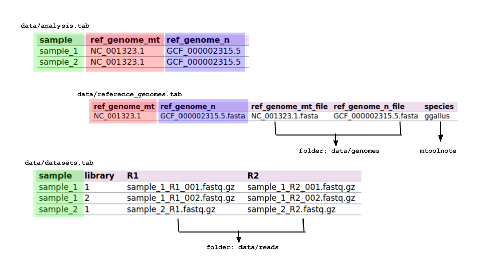

.. _mtoolbox_workflows:

The MToolBox-snakemake workflows
================================

.. contents::

MToolBox-snakemake includes several workflows, written in snakemake and conveniently embedded in wrappers. Using these wrappers will save a lot of typing and headache for the lazy users (probably *you*). Cool, isn't it? :)
 
All the wrappers accepts snakemake arguments and parse automatically the `config.yaml` configuration file required by snakemake.

You can find a list of the available workflows :ref:`at the end of this page<available_wrappers>`. 

An overview
-----------

The MToolBox-snakemake main workflow is **MToolBox-variant-calling**. The configuration of this workflow is shared with all the other MToolBox-snakemake workflows and it is reported in this section.

You are going to analyse one or more **samples**, represented by one or more read **datasets** (*ie*, libraries). 
For this purpose, you are going to provide a **reference mitochondrial genome**. Choose it carefully, as your final results will be based on it! You also have to pick a **reference nuclear genome** that will be used as reference to filter out ambiguous reads.

If you are interested in performing :ref:`functional annotation<mtoolbox_variant_annotation>` of mt variants, you will also explicitly provide **species**.

Now you'll be wondering: *how do I tell all these things to the pipeline*? In the following sections, we'll see how to do that through a handful of configuration files!

.. _setup_working_directory:

Setting up a working directory
------------------------------

.. note:: Replace :code:`/path/to/MToolBox/dir/` with the MToolBox-snakemake installation path and :code:`/path/to/analysis/dir` with the folder where you wish to run your analysis.

.. code-block:: bash
    
    export MTOOLBOX_DIR=/path/to/MToolBox/dir/
    
    cd /path/to/analysis/dir
    
    # create folders needed by the workflow
    mkdir -p data/reads
    mkdir -p data/genomes
    mkdir -p logs/cluster_jobs
    
    # copy configuration files you will edit later
    cp $MTOOLBOX_DIR/config.yaml .
    cp $MTOOLBOX_DIR/cluster.yaml .
    cp $MTOOLBOX_DIR/data/analysis.tab data
    cp $MTOOLBOX_DIR/data/datasets.tab data

At this point, if you run the command :code:`tree` the structure of your directory should look like

.. code-block:: bash
    
    .
    ├── cluster.yaml
    ├── config.yaml
    ├── data
    │   ├── analysis.tab
    │   ├── datasets.tab
    │   ├── genomes
    │   ├── reads
    │   └── reference_genomes.tab
    └── logs
        └── cluster_jobs

Compiling configuration files
-----------------------------

An MToolBox-snakemake workflow run is managed with these configuration files: 

- data/analysis.tab
- data/reference_genomes.tab
- data/datasets.tab
- config.yaml
- cluster.yaml

*Sounds a pain, huh?* The good news is that they will help you in setting up and keeping track of your analyses very efficiently. Plus, the config.yaml and cluster.yaml files should work the way they are, with little to no edit needed. **Please read the "Notes on configuration files" at the end of this section**.

Let's see how to compile the configuration files in detail.

- **data/analysis.tab**

For each sample you are going to analyse, in this table you provide info about which mitochondrial and nuclear reference genomes to use. Example:

+----------+---------------+-----------------+
| sample   | ref_genome_mt | ref_genome_n    |
+==========+===============+=================+
| sample_1 | NC_001323.1   | GCF_000002315.5 |
+----------+---------------+-----------------+
| sample_2 | NC_001323.1   | GCF_000002315.5 |
+----------+---------------+-----------------+

In this example, the first row specifies that variant calling will be performed on **sample_1** using the mitochondrial reference genome **NC_001323.1**, by discarding those reads aligning on the nuclear reference genome **GCF_000002315.5**. Please note that the names used in this table will be used in the workflow execution and are case-sensitive. Actual files related to samples and reference genomes will be provided in the **data/reference_genomes.tab** and in the **data/datasets.tab** files.

- **data/reference_genomes.tab**

Structure (strictly **tab-separated**):

+---------------+-----------------+--------------------+-----------------------+---------+
| ref_genome_mt | ref_genome_n    | ref_genome_mt_file | ref_genome_n_file     | species |
+===============+=================+====================+=======================+=========+
| NC_001323.1   | GCF_000002315.5 | NC_001323.1.fasta  | GCF_000002315.5.fasta | ggallus |
+---------------+-----------------+--------------------+-----------------------+---------+

This table contains explicit names for reference genome files used in the workflow. Names in the columns **ref_genome_mt** and **ref_genome_n** must be consistent with the ones in the same columns in the **data/analysis.tab** table. **Genome files must be located in the data/genomes folder**.

The name in the column **species** should be one of the `species available in mtoolnote`_ for variant functional annotation. 

- **data/datasets.tab**

Fill this table with as many read (paired) datasets are available per sample. Each read dataset will be processed independently and merged with the others from the same sample before the variant calling stage. **Read dataset files must be located in the data/reads folder**.

Example:

+----------+---------+--------------------------+--------------------------+
| sample   | library | R1                       | R2                       |
+==========+=========+==========================+==========================+
| sample_1 | 1       | sample_1_R1_001.fastq.gz | sample_1_R2_001.fastq.gz |
+----------+---------+--------------------------+--------------------------+
| sample_1 | 2       | sample_1_R1_002.fastq.gz | sample_1_R2_002.fastq.gz |
+----------+---------+--------------------------+--------------------------+
| sample_2 | 1       | sample_2_R1.fastq.gz     | sample_2_R2.fastq.gz     |
+----------+---------+--------------------------+--------------------------+

In this case, sample_1 is represented by two PE libraries, while sample_2 is represented by one.

- **config.yaml**

This file contains basic configuration for the whole workflow. Default configuration should fit most cases; you might want to check the following options:

    - `mark_duplicates`: remove duplicate alignments with Picard MarkDuplicates. Default is `False`.
    - `keep_orphans`: the first alignment round might leave some reads "orphan", *i.e.* their mate has been discarded. This can happen for two reasons: 1) the discarded read has so many sequencing errors it couldn't be properly mapped or 2) the discarded read maps *only* on the nuclear genome: this could mean that the whole read pair represents a nuclear region overlapping a NumtS (nuclear sequences of mitochondrial origin). Either case, you might want to discard these "orphan reads" since they could represent a source of error/noise for downstream analyses. Default is to keep them (`True`).
    - `trimBam`: read aligners sometime struggle to properly align reads at their ends when they contain an indel or when they encompass low-complexity regions or homopolymeric stretches. Despite all the post-processing efforts we could implement (*e.g.* read re-alignment around indels), misalignments could still make it to the variant calling step and introduce noise (*e.g.* variants with very low heteroplasmy fraction which eat into the HF of a properly called variant). To prevent this, you can choose to "mask" (soft-clip) 10 nucleotides at each alignment end. Default is `True` (mask the alignment ends). Please note that, at the moment, the number of nts you can mask at each end (10) cannot be modified.

- **cluster.yaml**

If you are analysing huge datasets, it would be a good idea to run MToolBox-snakemake on a computing cluster. The file cluster.yaml contains settings for this scenario, which should work well as they are.

A recap
^^^^^^^

    An overview of MToolBox-snakemake configuration files

How to run the MToolBox wrappers
--------------------------------

Running the wrappers is as simple as this:

.. code-block:: bash
    
    MToolBox-<wrapper> <snakemake arguments>

The :code:`MToolBox` wrapper scripts embed `snakemake`_ workflows, which allow an efficient and powerful management of all steps required to get the desired output files. In other words, with (roughly) the same command, you can run a full analysis, resume it or check its status. This is extremely useful in many settings, *e.g.* when you are running MToolBox-snakemake on a lot of samples.

**Graphical representation of the workflow**

Before running the workflow, it's good practice to check if the provided setup is correct. You can run

.. code-block:: bash
    
    MToolBox-variant-calling -nrp

to execute a dry run (*i.e.* simulate to run the workflow) and get a list of the files that will be created and the commands that will be run.

A graphical - and probably more user-friendly - representation of the workflow can be obtained by running

.. code-block:: bash
    
    MToolBox-variant-calling --dag | dot -Tsvg > my_workflow.svg

The graph in file `my_workflow.svg` will report all the workflow steps (for each sample in the `analysis.tab` configuration file). Steps in dashed lines are to be run (because their outputs are not present), whereas outputs for steps in solid lines are already present. A graphical representation of the workflow as per the `analysis.tab` file in this repo is reported as follows.

TODO: insert image.

**Ok, gotcha! How do I actually run the workflow then?**

.. code-block:: bash
    
    MToolBox-variant-calling -pk -j 8

This will run the :code:`MToolBox-variant-calling` wrapper, printing the commands that get executed and using at most 8 cores at the same time (*i.e.* allowing to run multiple commands at the same time *with no excessive risk* of blowing up your machine).

Running on a computing cluster
^^^^^^^^^^^^^^^^^^^^^^^^^^^^^^

If you wish to run a MToolBox-snakemake workflow on a huge number of samples and/or your datasets are of a considerable size, you might want to run the workflow on a computing cluster. In this case, you should instruct the job scheduler you're using on how to do it. with the :code:`--cluster` option. You might also want to run the process in background and redirect the standard error and output (*i.e.* all the messages printed on the screen) to a log file:

.. code-block:: bash
    
    MToolBox-variant-calling \
    -rpk \
    -j 100 \
    --cluster cluster.yaml \
    --cluster 'sbatch -A snic2018-8-310 -p core -n {cluster.threads} -t {cluster.time} -o {cluster.stdout}' &> logs/mtoolbox_run.log &

.. _available_wrappers:

Available wrappers
------------------

.. toctree::
   :maxdepth: 1 
   
   mtoolbox-variant-calling
   mtoolbox-variant-annotation

.. _`snakemake`: https://snakemake.readthedocs.io/en/stable/
.. _`species available in mtoolnote`: https://github.com/mitoNGS/mtoolnote#features